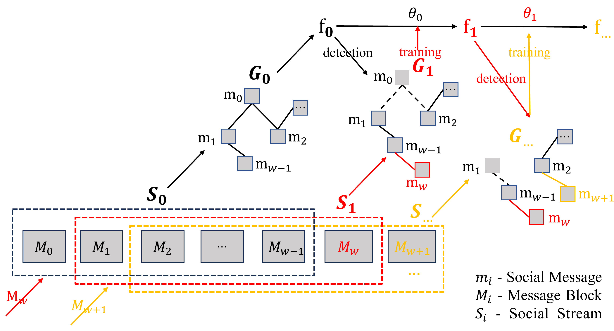

## Re-DHAN
---
This repository contains the source code and preprocessed dataset for the **2023 IEEE International Conference on Big Data (BigData2023, <font color=red>acceptance rate: 17.5% (92 out of 526)</font>)**  paper "[Social Event Detection with Reinforced Deep Heterogeneous Graph Attention Network](https://ieeexplore.ieee.org/abstract/document/10386153)".

## Method Framework
---
### ReDHAN_Offline_Model
---


### ReDHAN_Incremental_Model
---



## Run Re-DHAN
---

### Install PyTorch and PyG(torch-geometric)

We need to install torch-geometric packages.  
1) Uninstall Anaconda torch and its related PyG packages, and install suitable torch with pip order in terminal. For example,  
  - For local computer or laptop, installing torch-cpu version. For example,  
```bash
pip install torch==1.12.0
```  
  - For server application, installing torch-cuda version on server. You can check the compatible CUDA version from website [Previous PyTroch Version | PyTorch](https://pytorch.org/get-started/previous-versions/). For example,  
```bash
pip install torch==1.12.0+cu102
```  

2) Install compatible torch-cluster, torch-scatter, torch-sparse, and torch-spline-conv versions by checking the website https://data.pyg.org/whl/index.html.  
 - For torch-1.12.0 cpu version,
```bash
pip install torch-cluster==1.6.0 -f https://pytorch-geometric.com/whl/torch-1.12.0+cpu.html  
pip install torch-scatter==2.1.0 -f https://pytorch-geometric.com/whl/torch-1.12.0+cpu.html  
pip install torch-sparse==0.6.15 -f https://pytorch-geometric.com/whl/torch-1.12.0+cpu.html  
pip install torch-spline-conv==1.2.1 -f https://pytorch-geometric.com/whl/torch-1.12.0+cpu.html  
```  
 - For torch==1.12.0+cu102 CUDA version in server.
```bash
pip install torch-cluster==1.6.0 -f https://pytorch-geometric.com/whl/torch-1.12.0+cu102.html
pip install torch-scatter==2.1.0 -f https://pytorch-geometric.com/whl/torch-1.12.0+cu102.html  
pip install torch-sparse==0.6.15 -f https://pytorch-geometric.com/whl/torch-1.12.0+cu102.html  
pip install torch-spline-conv==1.2.1 -f https://pytorch-geometric.com/whl/torch-1.12.0+cu102.html  
```  

3) Just install torch-geometric with simple pip order
```bash
pip install torch-geometric
```

### Run Offline Detection Model
Open Re-DHAN_Model folder:  
1) run S2_generate_initial_features.py to generate the initial features for the messages.  
2) run S3_save_edge_index.py to generate indices for message embeddings.  
3) run run_offline_model.py

The incremental detection model is runned the way as above.  

## Experiments
---
- Twitter dataset  

The Twitter dataset [1] is collected to evaluate social event detection methods. After filtering out repeated and irretrievable tweets, the dataset contains 68,841 manually labeled tweets related to 503 event classes, spread over a period of four weeks. Please find the original dataset at http://mir.dcs.gla.ac.uk/resources/

Please refer to [this document](https://github.com/RingBDStack/KPGNN/blob/main/datasets/data_usage.md) for data format and usage.

- Baselines  
  - LDA2VEC, 2016. [2]
  - BERT, 2019. [3]
  - HAN, 2019. [4]
  - PPGCN, 2019. [5]
  - KPGNN, 2021. [6]
  - FinEvent, 2022. [7]

- The Experiment Results of Offline Social Event Detection

| Models | NMI_std | AMI_std | ARI_std |
| ------ | ------- | ------- | ------- |
| LDA2VEC | 0.752±0.010 | 0.632±0.018 | 0.436±0.01 |
| BERT | 0.617±0.012 | 0.427±0.018 | 0.234±0.031 |
| HAN | 0.844±0.014 | 0.763±0.023 | 0.648±0.037 |
| PPGCN | 0.617±0.194 | 0.450±0.268 | 0.383±0.269 |
| KPGNN | 0.847±0.011 | 0.769±**0.017** | 0.671±0.046 |
| FinEvent | 0.865±0.015 | 0.796±0.022 | 0.695±0.059 |
| Re-DHAN | **0.872**±**0.011** | **0.807**±0.018 | **0.743**±**0.032** |


## Citation
---
Y. Yu, J. Wu and J. Yang, "Social Event Detection with Reinforced Deep Heterogeneous Graph Attention Network," 2023 IEEE International Conference on Big Data (BigData), Sorrento, Italy, 2023, pp. 463-472, doi: 10.1109/BigData59044.2023.10386153.

## References
---
[1] Andrew J McMinn, Yashar Moshfeghi, and Joemon M Jose. 2013. Building a large-scale corpus for evaluating event detection on twitter. In Proceedings of the CIKM.ACM, 409–418.  
[2] C. E. Moody, “Mixing dirichlet topic models and word embeddings to make lda2vec,” 2016.  
[3] J. Devlin, M. Chang, K. Lee, and K. Toutanova, “BERT: pre-training of deep bidirectional transformers for language understanding,” in Proc. Conf. North Am. Chap. Assoc. Comput. Ling.: Human Lang. Technol. Minneapolis, MN, USA: Association for Computational Linguistics, 2019, pp. 4171–4186.  
[4] X. Wang, H. Ji, C. Shi, B. Wang, Y. Ye, P. Cui, and et al., “Heterogeneous graph attention network,” in World Wide Web conf., New York, NY, USA, 2019, pp. 2022–2032.  
[5] H. Peng, J. Li, Q. Gong, Y. Song, Y. Ning, K. Lai, and et al., “Finegrained event categorization with heterogeneous graph convolutional networks,” in Proc. 28th Int. Joint Conf. Artif. Intell. Macao, China: AAAI Press, 2019, pp. 3238–3245.  
[6] Y. Cao, H. Peng, J. Wu, Y. Dou, J. Li, and P. S. Yu, “Knowledgepreserving incremental social event detection via heterogeneous gnns,” in Proc. Web Conf. New York, NY, USA: Association for Computing Machinery, 2021, pp. 3383–3395.  
[7] H. Peng, R. Zhang, S. Li, Y. Cao, S. Pan, and S. Y. Philip, “Reinforced, incremental and cross-lingual event detection from social messages,” IEEE Trans. on Pattern Anal. Mach. Intell., vol. 45, no. 1, pp. 980–998, 2022.
